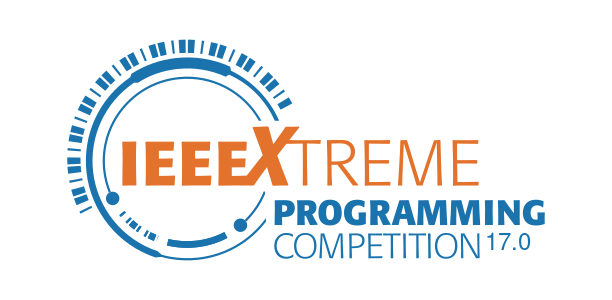

  

# IEEEXtreme 17.0 Solutions

Welcome to the IEEEXtreme 17.0 Solutions Repository! This repository contains my solutions to problems from the IEEEXtreme 17.0 programming competition. Each folder corresponds to a specific problem and includes both the problem statement (PDF) and my solution.

## Problems Solved

1. [Cool Sum](./Cool%20Sum)
2. [Dice](./Dice)
3. [Happy Numbers](./Happy%20Numbers)
4. [Programmers Poem](./Programmers%20Poem)
5. [Restaurant Cipher](./Restaurant%20Cipher)
6. [Rumors](./Rumors)
7. [War Games](./War%20Games)
8. [Caesar Redux](./caesar-redux)

## Repository Structure

Each problem folder typically contains:
- A PDF file with the problem statement
- Solution file

## Disclaimer

These solutions are my own work and were created for educational purposes. They may not be the most optimal solutions, but they passed the competition's test cases.

## Contributing

While this repository is primarily for personal use, suggestions for improvements or alternative solutions are welcome. Feel free to open an issue or submit a pull request.

## License

This project is open source and available under the [MIT License](LICENSE).

<h3 align="center">Connect with me:</h3>

  
  
  
  
  

